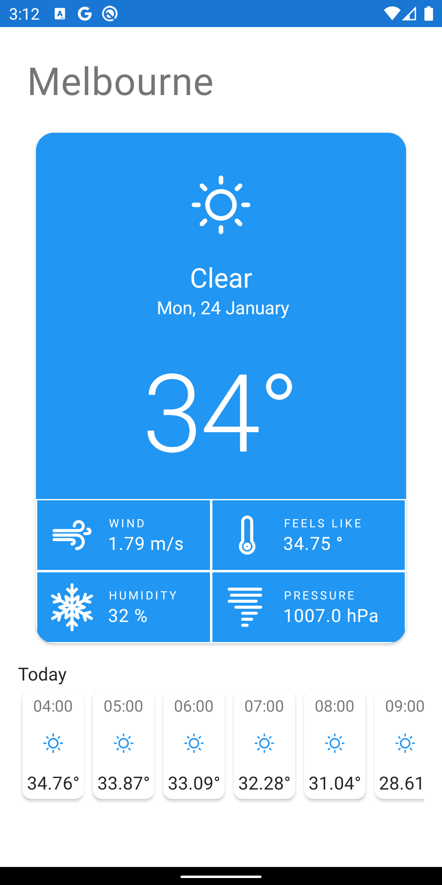

# Weather

A simple app to show some weather info

## Issues

This project has a number of issues. Head over to [issues](https://github.com/Gridstone/Weather-Android/issues) to find
out more

## Design

Design courtesy of [Muhammad Noufal](https://dribbble.com/muhammad_noufal))



## Data

We are consuming data straight from OpenWeatherMap API. We are making use
of [geo endpoint](https://openweathermap.org/current#geo).

API key configured as `API_KEY` in `BuildConfig`. Make sure to set `apiKey` in `local.properties`

```groovy
api_key="<API KEY HERE>"
```

## License

This project is copyright (C) Motorola Solutions Pty. Ltd. 2022.
